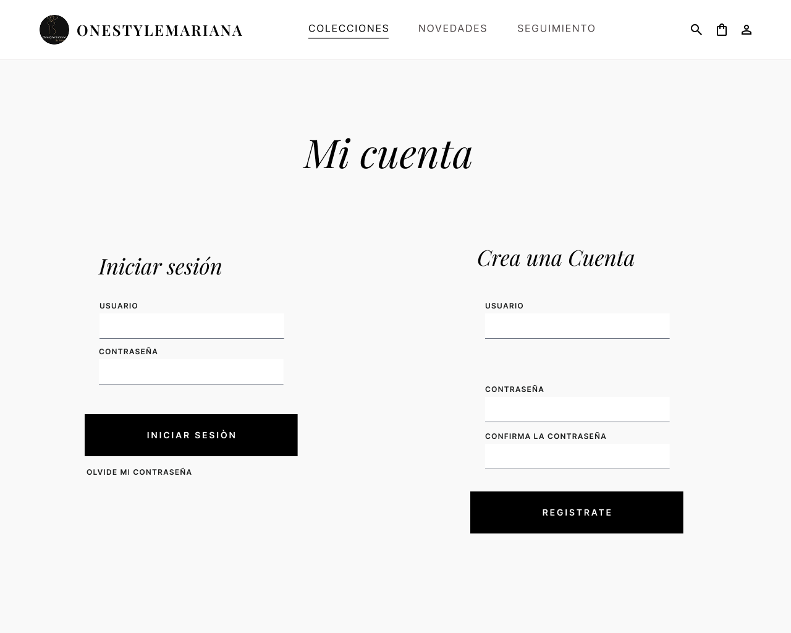
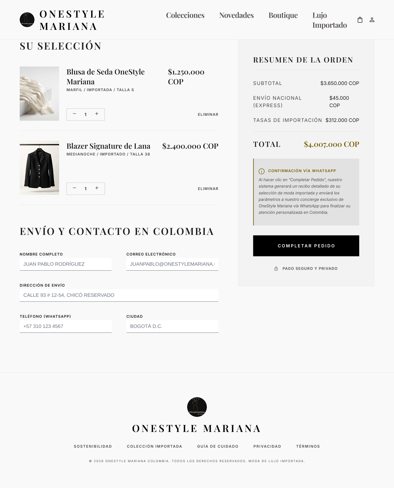
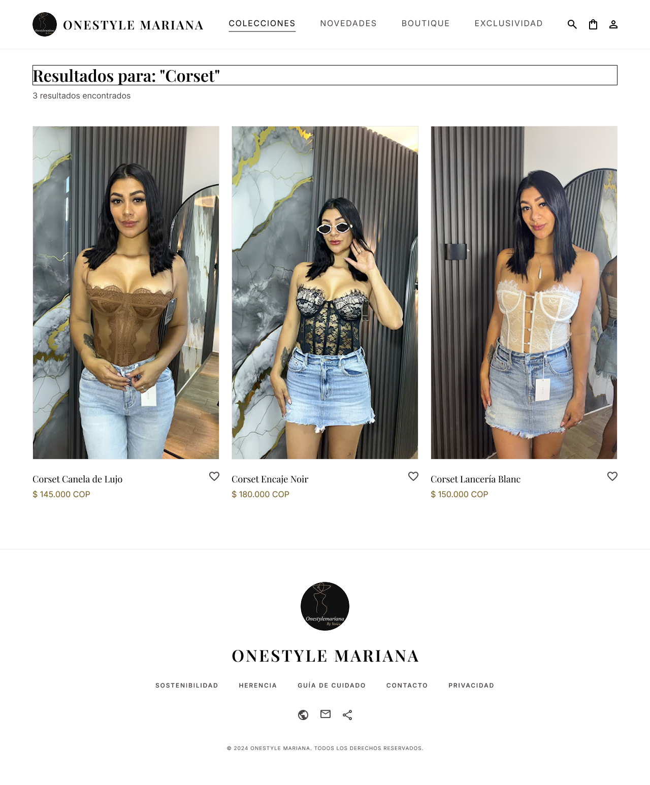

# G.C.C. OneStyle Mariana — Sistema de Gestión de Pedidos e Inventario (OMS)

<u>**Programa de Formación:**</u> Análisis y Desarrollo de Software (ADSO) — Código 3484008  
<u>**Fase del Proyecto:**</u> Hacer y Verificar  
<u>**Actividad de Proyecto:**</u> Desarrollar la estructura de datos y la interfaz de usuario del sistema de información  
<u>**Competencia:**</u> Evaluar requisitos de la solución de software de acuerdo con metodologías de análisis y estándares  

---

## 1. Descripción General del Proyecto

<u>**OneStyle Mariana**</u> es una plataforma web integral orientada al comercio electrónico y a la gestión operativa de pedidos (OMS) para una tienda de prendas de vestir femeninas. El sistema centraliza el catálogo público dinámico, implementa el control de inventario en tiempo real por variantes de producto (talla y color), automatiza el registro de auditoría transaccional y estructura el proceso de compra con generación de pedidos parametrizados hacia WhatsApp.

---

## 2. Arquitectura de Información y Navegación

### 2.1. Estructura Jerárquica del Sistema

El mapa de navegación define los flujos de interacción del usuario clasificados por niveles de acceso (público, autenticado y administrativo):

<p align="center">
  
</p>

### 2.2. Módulos de la Solución

* <u>**Módulo de Seguridad y Usuarios (`src/auth/`):**</u> Autenticación multi-rol (`Administradora`, `Vendedora`, `Clienta`), control de sesiones, validación de credenciales con hashing seguro y recuperación de acceso.
* <u>**Módulo de Catálogo e Inventario (`src/catalogo/`):**</u> Mantenimiento de categorías maestras, gestión de existencias por variantes (talla/color) y control de alertas por punto de reposición.
* <u>**Módulo de Carrito de Compras (`src/carrito/`):**</u> Validación de disponibilidad de stock en backend, modificación de cantidades, recálculo dinámico de subtotales y vaciado controlado (`RN-CART`).
* <u>**Módulo de Pedidos y Checkout (`src/pedidos/`):**</u> Captura obligatoria de datos de despacho, cálculo del monto total y generación de enlaces de confirmación para WhatsApp.
* <u>**Módulo de Auditoría y Trazabilidad (`src/auditoria/`):**</u> Registro automático e inmutable de eventos críticos sobre precios, existencias, roles y pedidos.

---

## 3. Modelo de Datos Relacional (Base de Datos)

### 3.1. Diagrama Entidad-Relación (MER)

El esquema relacional garantiza la integridad referencial y el soporte a transacciones concurrentes:

<p align="center">
  
</p>

### 3.2. Scripts SQL de Persistencia

* <u>**DDL Estructural (`database/schema.sql`):**</u> Define las tablas relacionales (`roles`, `usuarios`, `auditoria`, `categorias`, `tallas`, `colores`, `producto`, `producto_atributo`, `inventario`, `carrito`, `detalle_carrito`, `pedido`, `domicilio`, `reporte`) junto con sus llaves primarias, foráneas e índices únicos.
* <u>**Datos Semilla (`database/seeds.sql`):**</u> Carga la configuración inicial de roles de usuario y categorías base del catálogo.

---

## 4. Prototipo Interactivo y Mockups de Interfaz

### 4.1. Enlace al Prototipo Interactivo (Figma)

El diseño UI/UX del sistema se encuentra disponible para su navegación interactiva en Figma:

* <u>**Prototipo en Figma:**</u> [Ver Mockups Interactivos en Figma](https://www.figma.com/design/Ig7NbeizxVrNrnVWDm0lcA/onestyle?node-id=0-1&t=HpHegNwAzJQoyURV-1)[cite: 4]

### 4.2. Galería de Pantallas Principales

| Vista / Interfaz | Propósito Técnico | Captura de Diseño |
| :--- | :--- | :---: |
| **Inicio de Sesión** | Acceso seguro multi-rol (`RF-003b`). |  |
| **Catálogo Dinámico** | Visualización por categorías (`RF-008`). |  |
| **Detalle de Prenda** | Selector de talla, color y stock (`RF-009`). |  |
| **Bolsa de Compras** | Control y vaciado de carrito (`RF-010`. |  |
| **Búsqueda con Éxito** | Filtro dinámico de prendas (`RF-008`). |  |
| **Sin Resultados** | Retroalimentación de búsqueda (`RF-008`). |  |
| **Página de Error (404)** | Manejo de rutas inexistentes (`RNF-003`). |  |

---
## 5. Matriz de Requisitos y Trazabilidad

El análisis, especificación y trazabilidad de los 38 Requisitos Funcionales (RF), Requisitos No Funcionales (RNF bajo norma ISO/IEC 25010), Criterios de Aceptación y Casos de Prueba (Caja Blanca, Caja Negra e Integración) se gestionan de manera centralizada en la hoja de cálculo oficial:

* 🔗 <u>**Enlace Oficial:**</u> [Consultar Matriz de Trazabilidad y Requisitos en Google Sheets](https://docs.google.com/spreadsheets/d/1-zfgbSbrLl8uvnGb2gGCj1UpFA3TqOewWFdeeNKSH_s/edit?usp=sharing)
---

## 6. Estructura del Repositorio

```text
├── .github/
│   └── workflows/
│       └── tests.yml            # Pipeline de Integración Continua (CI) en GitHub Actions
├── database/
│   ├── schema.sql               # Script DDL de creación de tablas en MySQL / MariaDB
│   └── seeds.sql                # Inserción de datos maestros iniciales
├── docs/
│   ├── ent relacion/
│   │   ├── ent.puml             # Código fuente PlantUML del Modelo Entidad-Relación
│   │   └── entidad.png          # Renderizado visual del MER
│   ├── mapa navegacion/
│   │   ├── mapnav.puml          # Código fuente PlantUML de navegación (Mindmap)
│   │   └── mapanavegacion.png   # Renderizado visual del mapa de navegación
│   └── mockups/                 # Diseños de alta fidelidad exportados de Figma
│       ├── 404.png
│       ├── Detalleprenda.png
│       ├── Html.png
│       ├── busquedaexitosa.png
│       ├── busquedasinresultados.png
│       ├── carrito.png
│       ├── catalogo.png
│       └── login.png
├── src/
│   ├── __init__.py
│   ├── auditoria/               # Lógica de trazas y logs transaccionales
│   │   └── service.py
│   ├── auth/                    # Lógica de usuarios, roles y autenticación
│   │   └── service.py
│   ├── carrito/                 # Lógica de control de carrito y validación de stock
│   │   └── service.py
│   ├── catalogo/                # Lógica de productos, variantes y existencias
│   │   └── service.py
│   ├── modulos/                 # Prototipos visuales y referencias gráficas
│   │   └── prototipo_catalogo_inventario.html
│   └── pedidos/                 # Lógica de pedidos, totalización y WhatsApp
│       └── service.py
├── tests/
│   ├── __init__.py
│   └── unit/                    # Suite de pruebas unitarias (Mindset TDD)
│       ├── test_auth.py
│       ├── test_carrito.py
│       └── test_pedidos.py
├── .gitignore
├── Matriz de requisitos         # Enlace directo a la Matriz de Trazabilidad
├── requirements.txt             # Dependencias del proyecto (pytest)
└── README.md                    # Documentación técnica oficial
