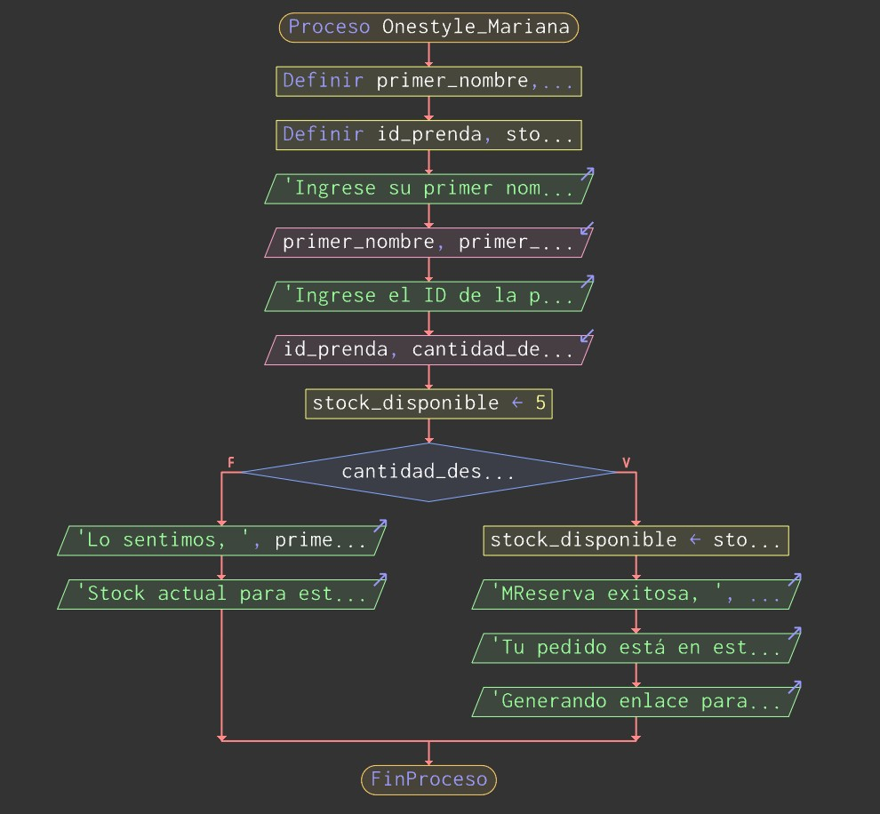
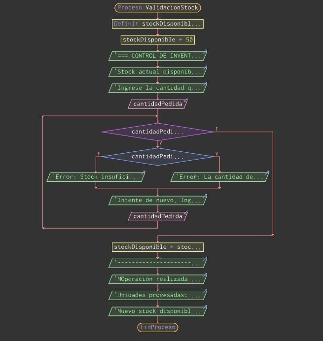

# Concepto OneStyle - Mariana

Descripción
-----------
Este repositorio contiene los recursos y el desarrollo del reto "Arquitecto de Soluciones" correspondiente al módulo 3.2: Modelado y Lógica. Su propósito es documentar y ejemplificar enfoques de modelado, razonamiento y diseño de soluciones que simulen o representen principios de ingeniería del conocimiento (la denominada "Ingeniería del Cerebro").

Lenguaje principal
------------------
Python, SQL

Objetivos
---------
- Documentar el enfoque conceptual y las decisiones de modelado.
- Proveer ejemplos y plantillas que ilustren patrones de lógica y arquitectura.

## Estructura del Proyecto

El proyecto está organizado en las siguientes carpetas principales:

- `database/`: Contiene los scripts DDL de la base de datos MySQL/MariaDB (`schema.sql`) y los datos iniciales (`seeds.sql`).
- `src/`: Contiene los módulos principales de lógica de negocio escritos en Python:
  - `auth/`: Autenticación de usuarios y roles.
  - `catalogo/`: Gestión de productos, variantes e inventario.
  - `carrito/`: Gestión del carrito de compras y validaciones de stock.
  - `pedidos/`: Creación de pedidos y generación de enlaces de WhatsApp.
  - `auditoria/`: Registro de logs de acciones importantes.
  - `modulos/`: Contiene imágenes de los flujos o pseudocódigos antiguos.
- `tests/`: Pruebas unitarias para los módulos Python utilizando `pytest`.
- `docs/`: Documentación, diagramas UML, y mapas de navegación del proyecto.

## Documentación y Diagramas

A continuación se presentan los recursos de diseño y requerimientos del proyecto:

### Matriz de Requisitos
[Ver Matriz de Requisitos (Google Sheets)](https://docs.google.com/spreadsheets/d/1-zfgbSbrLl8uvnGb2gGCj1UpFA3TqOewWFdeeNKSH_s/edit?usp=sharing)

### Modelo Entidad-Relación
El diseño relacional de la base de datos se basa en el siguiente modelo:


### Mapa de Navegación
La estructura y flujo de navegación para los diferentes perfiles:


### Mockups y Flujos de Lógica
| Diagrama de Stock | Diagrama Stick |
|:---:|:---:|
|  |  |

## Instrucciones de Uso

### 1. Base de Datos

Para inicializar la base de datos, ejecuta los siguientes scripts SQL en tu servidor MySQL/MariaDB:

1. Estructura de tablas: `mysql -u usuario -p base_de_datos < database/schema.sql`
2. Datos iniciales: `mysql -u usuario -p base_de_datos < database/seeds.sql`

### 2. Entorno y Pruebas Locales (TDD)

El proyecto utiliza `pytest` para las pruebas unitarias. Para ejecutarlas:

1. Instala las dependencias:
   ```bash
   pip install -r requirements.txt
   ```
2. Ejecuta los tests:
   ```bash
   PYTHONPATH=. pytest tests/
   ```

El proyecto también incluye un flujo de trabajo CI (`.github/workflows/tests.yml`) para ejecutar automáticamente estas pruebas en cada push o pull request.
