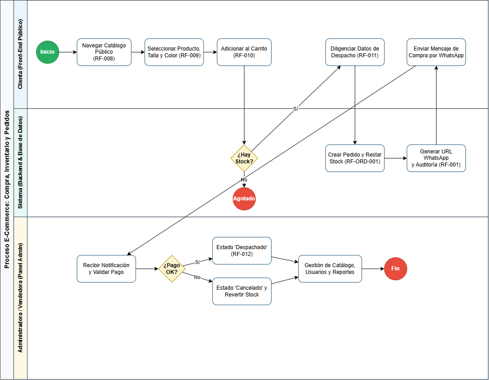

# G.C.L. Onestylemariana — Sistema de Gestión de Pedidos e Inventario (OMS)

<u>**Programa de Formación:**</u> Análisis y Desarrollo de Software (ADSO) — Código 3484008  
<u>**Fase del Proyecto:**</u> Hacer y Verificar  
<u>**Actividad de Proyecto:**</u> Desarrollar la estructura de datos y la interfaz de usuario del sistema de información  
<u>**Competencia:**</u> Evaluar requisitos de la solución de software de acuerdo con metodologías de análisis y estándares  

---

## 1. Descripción General del Proyecto

<u>**OneStyle Mariana**</u> es una plataforma web integral orientada al comercio electrónico y a la gestión operativa de pedidos (OMS) para una tienda de prendas de vestir femeninas. El sistema centraliza el catálogo público dinámico, implementa el control de inventario en tiempo real por variantes de producto (talla y color), automatiza el registro de auditoría transaccional y estructura el proceso de compra con generación de pedidos parametrizados hacia WhatsApp.

### 1.1 Ficha del proyecto

<u>**Ficha de proyecto**</u> La ficha de proyecto es aquella que contiene la información básica en la cuál se basará el proyecto.
[Ficha de Proyecto](https://docs.google.com/document/d/1ppfRl-d0_CExBpV_6StK5nX_CzcZ6Jub/edit?usp=sharing&ouid=104494591903208453248&rtpof=true&sd=true)

---

## 2. Arquitectura de Información y Navegación

### 2.1. Estructura Jerárquica del Sistema

El mapa de navegación define los flujos de interacción del usuario clasificados por niveles de acceso (público, autenticado y administrativo):


### 2.2. Módulos de la Solución

* <u>**Módulo de Seguridad y Usuarios (`src/auth/`):**</u> Autenticación multi-rol (`Administradora`, `Vendedora`, `Clienta`), control de sesiones, validación de credenciales con hashing seguro y recuperación de acceso.
* <u>**Módulo de Catálogo e Inventario (`src/catalogo/`):**</u> Mantenimiento de categorías maestras, gestión de existencias por variantes (talla/color) y control de alertas por punto de reposición.
* <u>**Módulo de Carrito de Compras (`src/carrito/`):**</u> Validación de disponibilidad de stock en backend, modificación de cantidades, recálculo dinámico de subtotales y vaciado controlado (`RN-CART`).
* <u>**Módulo de Pedidos y Checkout (`src/pedidos/`):**</u> Captura obligatoria de datos de despacho, cálculo del monto total y generación de enlaces de confirmación para WhatsApp.
* <u>**Módulo de Auditoría y Trazabilidad (`src/auditoria/`):**</u> Registro automático e inmutable de eventos críticos sobre precios, existencias, roles y pedidos.

---

## 3. Modelo de Datos Relacional (Base de Datos)

### 3.1. Diagrama Entidad-Relación (MER)

El esquema relacional garantiza la integridad referencial y el soporte a transacciones concurrentes:


### 3.2. Scripts SQL de Persistencia

* <u>**DDL Estructural (`database/schema.sql`):**</u> Define las tablas relacionales (`roles`, `usuarios`, `auditoria`, `categorias`, `tallas`, `colores`, `producto`, `producto_atributo`, `inventario`, `carrito`, `detalle_carrito`, `pedido`, `domicilio`, `reporte`) junto con sus llaves primarias, foráneas e índices únicos.
* <u>**Datos Semilla (`database/seeds.sql`):**</u> Carga la configuración inicial de roles de usuario y categorías base del catálogo.

---
### 3.3. Diccionario de Datos Oficial (20 Entidades)
La especificación detallada de los 112 atributos, tipos de datos, restricciones de nulidad y reglas de negocio se encuentra documentada en su artefacto dedicado:

* 📄 **Documentación Técnica Completa:** [Consultar Diccionario de Datos (Markdown)](<docs/diccionariodatos.md>)
* 📊 **Versión Tabular:** [Descargar / Ver en Hoja de Cálculo (CSV)](https://docs.google.com/spreadsheets/d/1mqC6APqGv4mV4Q4Fhi1ud-hDtJPYeUUlx1HZXviDsxI/edit?usp=sharing)

---

## 4. Prototipo Interactivo y Mockups de Interfaz

### 4.1. Enlace al Prototipo Interactivo (Figma)

El diseño UI/UX del sistema se encuentra disponible para su navegación interactiva en Figma:

* <u>**Prototipo en Figma:**</u> [Ver Mockups Interactivos en Figma](https://www.figma.com/design/Ig7NbeizxVrNrnVWDm0lcA/onestyle?node-id=0-1&t=HpHegNwAzJQoyURV-1)

### 4.2. Galería de Pantallas Principales

| Vista / Interfaz | Propósito Técnico | Captura de Diseño |
| :--- | :--- | :---: |
| **Inicio de Sesión** | Acceso seguro multi-rol (`RF-003b`). |  |
| **Proceso de recuperar contraseña** | Ingreso de correo (`RF-003i, RF-003j`). | .png>) |
| **Proceso de recuperar contraseña** | Solicitud de envío (`RF-003i, RF-003j`). | .png>) |
| **Proceso de recuperar contraseña** | Creación de contraseña (`RF-003i, RF-003j`). | .png>) |
| **Proceso de recuperar contraseña** | Contraseña cambiada (`RF-003i, RF-003j`). |  |
| **Proceso de recuperar contraseña** | Token expirado (`RF-003i, RF-003j`). |  |
| **Catálogo Dinámico** | Visualización por categorías (`RF-008`). | .png>) |
| **Detalle de Prenda** | Selector de talla, color y stock (`RF-009`). | .png>) |
| **Bolsa de Compras** | Control y vaciado de carrito (`RF-010`). |  |
| **Búsqueda con Éxito** | Filtro dinámico de prendas (`RF-008`). |  |
| **Sin Resultados** | Retroalimentación de búsqueda (`RF-008`). |  |
| **Categorias de la ropa** | Visualización de filtrado por tipo de prenda (`RF-007a`). | |
| **Página de Error (404)** | Manejo de rutas inexistentes (`RNF-003`). | .png>) |
| **Vista_Admin_OMS** | Gestión y trazabilidad del ciclo de vida de los pedidos (`RF-012`). |  |
| **Vista_Admin_Inventario** | Administración CRUD de productos y control del stock disponible (`RF-004, RF-004b, RF-004c, RF-004d, RF-006, RF-PROD-005`). |  |
| **Vista_Admin_Categorias** | Gestión estructurada de las categorías de productos (`RF-007`). | .png>) |
| **Vista_Admin_Atributos** | Administración de datos maestros para tallas y colores de los productos (`RF-PROD-004`). | .png>) |
| **Vista_Admin_Usuarios** | Gestión de usuarios internos, roles y estados de acceso (`RF-003e`). | .png>) |
| **Vista_Dashboard** | Consolidación y visualización de indicadores para el análisis administrativo (`RF-013`). |  |
| **Vista_Auditoria** | Trazabilidad e historial inmutable de las operaciones realizadas en el sistema (`RF-001, RF-001b, RF-001c, RF-001d`). |  |
| **Vista_Admin_FAQ** | Administración y organización del contenido del centro de ayuda (`RF-FAQ-005, RF-FAQ-006, RF-FAQ-007`). |  |

### 4.3. CU y Diagramas
### 1.Diagramas de Casos de Uso por Módulos
El modelado funcional del sistema **G.C.L. OneStyle Mariana** se desacopla en **5 módulos independientes**, manteniendo trazabilidad directa con la base de datos física y la matriz de requisitos:

| Módulo | Diagrama UML (PlantUML) | Cobertura Técnica |
| :--- | :---: | :--- |
| **Módulo 1: Seguridad y Usuarios** |  | **Actores:** Visitante, Clienta, Admin.<br>**Requisitos:** `RF-001d`, `RF-002`, `RF-003a-g`.<br>**Tablas BD:** `usuarios`, `roles`, `auditoria`. |
| **Módulo 2: Catálogo e Inventario** |  | **Actores:** Visitante, Administradora.<br>**Requisitos:** `RF-004` al `RF-009`, `RF-PROD-004/005`.<br>**Tablas BD:** `producto`, `producto_atributo`, `inventario`. |
| **Módulo 3: Carrito de Compras** |  | **Actores:** Clienta.<br>**Requisitos:** `RF-010`, `RF-CART-010`.<br>**Tablas BD:** `carrito`, `detalle_carrito`, `inventario`. |
| **Módulo 4: Pedidos y Gestión (OMS)** |  | **Actores:** Clienta, Vendedora, WhatsApp API.<br>**Requisitos:** `RF-011`, `RF-012`, `RF-ORD-001/002`.<br>**Tablas BD:** `pedido`, `detalle_pedido`, `domicilio`. |
| **Módulo 5: Soporte y FAQ** |  | **Actores:** Visitante, Clienta, Vendedora, Admin.<br>**Requisitos:** `RF-FAQ-001` al `007`, `RF-SOP-001`.<br>**Tablas BD:** `faq`, `categorias_faq`, `configuracion_soporte`. |

> 📄 **Especificación Detallada de Casos de Uso:** Para consultar la descripción narrativa de flujos principales, alternos y reglas de negocio paso a paso, revise el [Documento Formal de Casos de Uso en Google Docs](https://docs.google.com/document/d/1SimBp-0BJighWeZRdFHGI5peXwmv6t6e1VyrG6NXkP0/edit?usp=sharing).

---

#### 2. Diagrama de Actividades y Procesos de Negocio (BPMN)
Modelado procedimental de los flujos operativos, decisiones lógicas y transiciones de estado del sistema:

| Diagrama de Actividades | Diagrama BPMN Principal |
| :---: | :---: |
|  |  |
| **Flujo de Acciones y Decisiones Lógicas** | **Proceso Macro de Negocio** |

| Subproceso BPMN 1 & 2 | Subproceso BPMN 3 & FAQ |
| :---: | :---: |
|  |  |
|  |  |

---
## 5. Matriz de Requisitos y Trazabilidad

El análisis, especificación y trazabilidad de los 38 Requisitos Funcionales (RF), Requisitos No Funcionales (RNF bajo norma ISO/IEC 25010), Criterios de Aceptación y Casos de Prueba (Caja Blanca, Caja Negra e Integración) se gestionan de manera centralizada en la hoja de cálculo oficial:

* 🔗 <u>**Enlace Oficial:**</u> [Consultar Matriz de Trazabilidad y Requisitos en Google Sheets](https://docs.google.com/spreadsheets/d/1-zfgbSbrLl8uvnGb2gGCj1UpFA3TqOewWFdeeNKSH_s/edit?usp=sharing)
* 📄 <u>**Matriz de Requisitos:**</u> [Ver documento](https://docs.google.com/spreadsheets/d/1-zfgbSbrLl8uvnGb2gGCj1UpFA3TqOewWFdeeNKSH_s/edit?usp=sharing)
---

## 6. Historias de Usuario

* 🔗 <u>**Enlace de Historias**</u> https://docs.google.com/spreadsheets/d/1xfWg9ZDWIMq2iLZ2_5q8NksZCSTSHnr9pvF7R4X3xCo/edit?usp=sharing

## 7. Estructura del Repositorio

```text
├── .github/
│   └── workflows/
│       └── tests.yml                                        # Pipeline de Integración Continua (CI) con GitHub Actions (Pytest)
├── database/                                                # Capa de persistencia y modelos relacionales (MySQL / MariaDB)
│   ├── schema.sql                                           # Script DDL oficial con la definición de las 20 tablas relacionales
│   └── seeds.sql                                            # Inserción de datos semilla maestros (roles del sistema y categorías)
├── docs/                                                    # Documentación de ingeniería de software, modelos y artefactos visuales
│   ├── Bpmn/                                                # Modelado formal de procesos de negocio (BPMN 2.0)
│   │   ├── Bpmn FAQ.png                                     # Renderizado visual del subproceso de atención y preguntas frecuentes
│   │   ├── Bpmn_FAQ.puml                                    # Código fuente PlantUML del subproceso de soporte y FAQ
│   │   ├── bpmn.drawio.png                                  # Diagrama macro de negocio consolidado exportado desde Draw.io
│   │   ├── bpmn.drawio.xml                                  # Archivo editable de Draw.io con el modelado de procesos
│   │   ├── codigo diagrama 2.puml                           # Código PlantUML del subproceso logístico y asignación de vendedora
│   │   ├── codigo diagrama 3.puml                           # Código PlantUML del subproceso de validación de pago y WhatsApp
│   │   ├── codigo diagrama1.puml                            # Código PlantUML del subproceso de exploración y compra de la clienta
│   │   ├── diagrama bpmn 1.png                              # Renderizado visual del proceso de adquisición y reserva en carrito
│   │   ├── diagrama bpmn 2.png                              # Renderizado visual del proceso operativo de empaque y despacho OMS
│   │   └── diagrama bpmn 3.png                              # Renderizado visual de la confirmación asistida vía WhatsApp
│   ├── Casos de uso/                                        # Modelado funcional UML de interacciones del sistema (5 módulos)
│   │   ├── cu_carrito.png                                   # Diagrama de casos de uso renderizado: Módulo 3 (Carrito de Compras)
│   │   ├── cu_carrito.puml                                  # Código PlantUML: Módulo 3 (Carrito, reservas de stock y subtotales)
│   │   ├── cu_catalogo.png                                  # Diagrama de casos de uso renderizado: Módulo 2 (Catálogo e Inventario)
│   │   ├── cu_catalogo.puml                                 # Código PlantUML: Módulo 2 (Gestión de variantes, prendas y filtros)
│   │   ├── cu_faq.png                                       # Diagrama de casos de uso renderizado: Módulo 5 (Soporte y FAQ)
│   │   ├── cu_faq.puml                                      # Código PlantUML: Módulo 5 (Preguntas frecuentes y configuración de soporte)
│   │   ├── cu_pedido.png                                    # Diagrama de casos de uso renderizado: Módulo 4 (Pedidos y OMS)
│   │   ├── cu_pedido.puml                                   # Código PlantUML: Módulo 4 (Ciclo de vida de órdenes y venta asistida)
│   │   ├── cu_seguridad.png                                 # Diagrama de casos de uso renderizado: Módulo 1 (Seguridad y Usuarios)
│   │   └── cu_seguridad.puml                                # Código PlantUML: Módulo 1 (Autenticación, RBAC y auditoría inmutable)
│   ├── diagramaactividades/                                 # Modelado dinámico procedimental y lógica de control
│   │   ├── act diag.png                                     # Renderizado visual del flujo de actividades y decisiones del checkout
│   │   └── actdi.puml                                       # Código PlantUML del diagrama de actividades con swimlanes por rol
│   ├── ent relacion/                                        # Modelado conceptual y lógico de base de datos
│   │   ├── ent.puml                                         # Código fuente PlantUML del Modelo Entidad-Relación (20 entidades)
│   │   └── entidad.png                                      # Renderizado gráfico de la topología relacional y llaves foráneas
│   ├── mapa navegacion/                                     # Arquitectura de información y rutas de usuario (UX/UI)
│   │   ├── mapanavegacion.png                               # Renderizado gráfico de la estructura jerárquica de vistas y accesos
│   │   └── mapnav.puml                                      # Código fuente PlantUML Mindmap con el árbol de pantallas del sistema
│   ├── mockups/                                             # Prototipos de alta fidelidad exportados del diseño de interfaz (Figma)
│   │   ├── 404(1).png                                       # Vista de error de página o recurso no encontrado (RNF-003)
│   │   ├── Detalle prenda (1).png                           # Vista interactiva con selector de variantes (talla, color y existencias)
│   │   ├── Panel Admin Tallas.png                           # Back-office: parametrización y administración de atributos de variantes
│   │   ├── Panel admin categorías.png                       # Back-office: gestión CRUD de categorías maestras del catálogo
│   │   ├── Panel admin usuarios.png                         # Back-office: control de usuarios internos, roles y bajas lógicas
│   │   ├── Vista_Admin_FAQ – Administración...png           # Back-office: panel para alta, edición y ordenamiento de preguntas frecuentes
│   │   ├── Vista_Admin_Inventario – Gestión...png           # Back-office: catálogo administrativo, control de stock y puntos de reposición
│   │   ├── Vista_Admin_OMS – Gestión de pedidos.png         # Back-office: tablero Kanban/operativo para trazabilidad y despacho de órdenes
│   │   ├── Vista_Auditoria – Registro de operaciones.png    # Back-office: visor inmutable de logs transaccionales y cambios críticos
│   │   ├── Vista_Dashboard – Panel de indicadores.png       # Back-office: consolidación de KPIs financieros, volumen y desempeño por vendedora
│   │   ├── busqueda exitosa1.png                            # Front-office: listado de coincidencias en catálogo tras búsqueda dinámica
│   │   ├── busqueda sin resultados1.png                     # Front-office: estado vacío y sugerencias ante búsquedas no coincidentes
│   │   ├── carrito1.png                                     # Front-office: vista de resumen de bolsa, subtotales y control de cantidades
│   │   ├── catalogo (2).png                                 # Front-office: vitrina pública con filtros por categoría y precio unitario
│   │   ├── categorias.png                                   # Front-office: menú estructurado de navegación por líneas de prenda
│   │   └── login1.png                                       # Pantalla de inicio de sesión con control de acceso basado en roles (RBAC)
│   ├── Historias de Usuario Consolidadas...csv              # Matriz de Historias de Usuario (HU) con criterios de aceptación Gherkin
│   ├── board.jpg                                            # Tablero visual / Storyboard del recorrido del usuario
│   ├── diccionariodatos.md                                  # Especificación técnica formal de los 112 atributos y reglas de la base de datos
│   └── matrizrfrn.csv                                       # Matriz tabular de Requisitos Funcionales y No Funcionales (ISO/IEC 25010)
├── src/                                                     # Código fuente de la lógica de negocio y servicios modulares
│   ├── auditoria/                                           # Lógica del Módulo 1 (Trazabilidad y registro de eventos críticos)
│   │   ├── __init__.py                                      # Inicializador del paquete Python de auditoría
│   │   └── service.py                                       # Servicio para persistencia inmutable de logs en la tabla `auditoria`
│   ├── auth/                                                # Lógica del Módulo 1 (Seguridad, control de roles y autenticación)
│   │   ├── __init__.py                                      # Inicializador del paquete Python de autenticación
│   │   └── service.py                                       # Servicio de hashing de contraseñas, login y validación de permisos RBAC
│   ├── carrito/                                             # Lógica del Módulo 3 (Bolsa de compras y reservas temporales)
│   │   ├── __init__.py                                      # Inicializador del paquete Python de carrito
│   │   └── service.py                                       # Servicio de cálculo de subtotales y reserva de stock en `detalle_carrito`
│   ├── catalogo/                                            # Lógica del Módulo 2 (Gestión de catálogo, variantes y stock)
│   │   ├── __init__.py                                      # Inicializador del paquete Python de catálogo
│   │   └── service.py                                       # Servicio de consulta con filtros y control de existencias por talla/color
│   ├── modulos/                                             # Recursos estáticos y prototipos web navegables de apoyo
│   │   ├── prototipo_catalogo_inventario.html               # Maquetación funcional preliminar del catálogo en HTML/CSS
│   │   ├── stick.jpg                                        # Recurso gráfico de interfaz de usuario
│   │   └── stock.jpg                                        # Recurso gráfico de interfaz de usuario
│   ├── pedidos/                                             # Lógica del Módulo 4 (Gestión OMS, cálculo de totales y WhatsApp)
│   │   ├── __init__.py                                      # Inicializador del paquete Python de pedidos
│   │   └── service.py                                       # Servicio para creación de órdenes, asignación de vendedora y payload a WhatsApp
│   └── __init__.py                                          # Raíz del paquete de módulos del sistema
├── tests/                                                   # Suite de pruebas automatizadas con enfoque TDD (Test-Driven Development)
│   ├── unit/                                                # Pruebas unitarias sobre componentes de backend aislados
│   │   ├── __init__.py                                      # Inicializador del paquete de pruebas unitarias
│   │   ├── test_auth.py                                     # Casos de prueba: autenticación, restricción de roles y hashing
│   │   ├── test_carrito.py                                  # Casos de prueba: cálculo de totales, límites de stock y vaciado
│   │   └── test_pedidos.py                                  # Casos de prueba: formalización de órdenes, estados y payload a WhatsApp
│   └── __init__.py                                          # Inicializador de la suite general de pruebas
├── README.md                                                # Ficha técnica, arquitectura y manual oficial del repositorio
└── requirements.txt                                         # Dependencias y librerías del proyecto para el entorno virtual (pytest)
